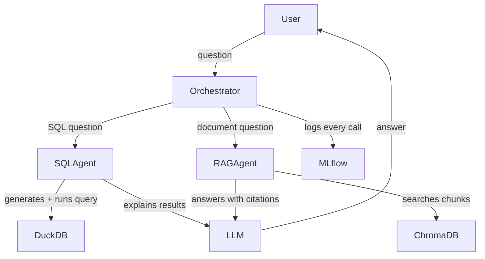

# 🔍 DataScope

A multi-agent AI analytics system that answers natural language questions about business data and documents.


## What It Does

Ask DataScope a question in plain English. It automatically routes it to the right agent:

- **SQL Agent** — queries the Northwind business database and explains results
- **RAG Agent** — searches internal documents and answers with cited sources
- **Orchestrator** — decides which agent to use based on your question

## Architecture



## Tech Stack

| Layer | Technology |
|---|---|
| LLM | Llama 3.3 70B via Groq API |
| Agent Orchestration | Custom multi-agent router |
| RAG / Vector Store | ChromaDB + ONNX embeddings |
| Analytics Database | DuckDB |
| API | FastAPI + Uvicorn |
| UI | Streamlit |
| LLMOps | MLflow |
| Containerization | Docker + Docker Compose |

## Quickstart

**Prerequisites:** Docker Desktop, Groq API key (free at console.groq.com)

```bash
# 1. Clone the repo
git clone https://github.com/scottxinshi/datascope.git
cd datascope

# 2. Set up environment variables
cp .env.example .env
# Open .env and add your GROQ_API_KEY

# 3. Build containers
docker-compose build

# 4. Run
docker-compose up
```

Open **http://localhost:8501** in your browser.

## Example Questions

**SQL Agent (data questions):**
- "Which country has the most orders?"
- "What are the top 3 most expensive products?"
- "Which customers are from Germany?"

**RAG Agent (document questions):**
- "What is the return policy?"
- "How long does international shipping take?"
- "Which products are gluten-free?"

## Project Structure

```
datascope/
├── agents/
│   ├── orchestrator.py     # Routes questions to the right agent
│   ├── sql_agent.py        # Generates and executes SQL queries
│   └── rag_agent.py        # Searches documents with vector similarity
├── pipelines/
│   └── ingest_documents.py # Chunks and embeds documents into ChromaDB
├── api/
│   └── main.py             # FastAPI REST endpoint
├── ui/
│   └── app.py              # Streamlit chat interface
├── llmops/
│   └── tracker.py          # MLflow tracking for every LLM call
├── data/                   # Northwind CSV dataset
├── docs/                   # Business documents for RAG
├── Dockerfile.api
├── Dockerfile.ui
└── docker-compose.yml
```

## LLMOps

Every LLM call is tracked with MLflow — question, route, answer, latency, token usage, and estimated cost.

To view the dashboard:
```bash
mlflow ui
```
Open **http://127.0.0.1:5000**

## Built By

**Scott Shi** — Data Engineer transitioning to AI Engineering

[](https://www.linkedin.com/in/scott-xin-shi)
[](https://github.com/scottxinshi)
